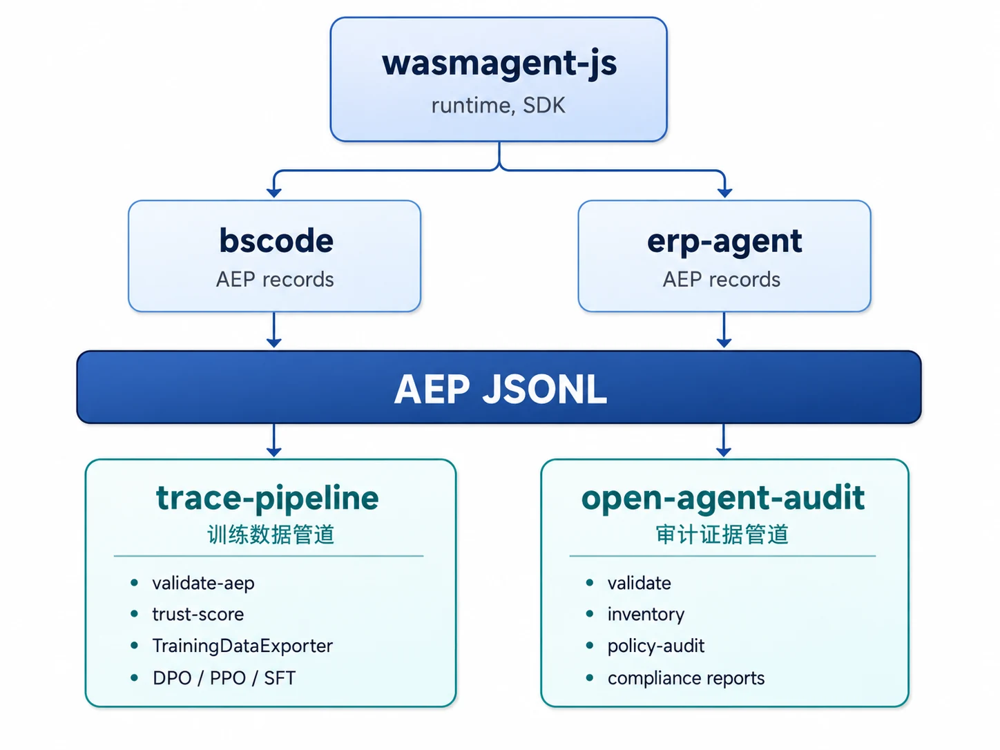

# WasmAgent

**Auditable, policy-enforced AI agent runtime for Cloudflare Workers and beyond.**

This is the public project home for WasmAgent — roadmap, media ledger, release ledger,
and claim registry index.

## Repositories

| Repository | Purpose |
|---|---|
| [wasmagent-js](https://github.com/WasmAgent/wasmagent-js) | Core JS/TS runtime, MCP server, policy/evidence packages |
| [bscode](https://github.com/WasmAgent/bscode) | Cloudflare Workers benchmark & demo workload |
| [trace-pipeline](https://github.com/WasmAgent/trace-pipeline) | Trace ingestion, audit, claim/eval pipeline |
| [open-agent-audit](https://github.com/WasmAgent/open-agent-audit) | Open evidence format and Cloudflare-native audit toolkit |
| [wasmagent](https://github.com/WasmAgent/wasmagent) | This repo — project home, ledgers, roadmap |

## Key concepts

- **Agent Execution Proof (AEP)** — every tool call produces a structured, hash-linked audit record
- **MCP Trust Pack** — policy enforcement and capability attestation for MCP servers
- **Compliance Engine** — runtime instruction-following evaluation + repair pipeline
- **Trace-to-Training** — agent runs become structured training data via `ComplianceEvalRecord`

## Media

See [media/posts.yml](media/posts.yml) for published articles and their claim bindings.

## Claims

See [claims/public-claims.yml](claims/public-claims.yml) for verified public claims with evidence links.

## Releases

See [releases/public-release-ledger.yml](releases/public-release-ledger.yml) for the release history.

## Roadmap

See [docs/roadmap.md](docs/roadmap.md).
